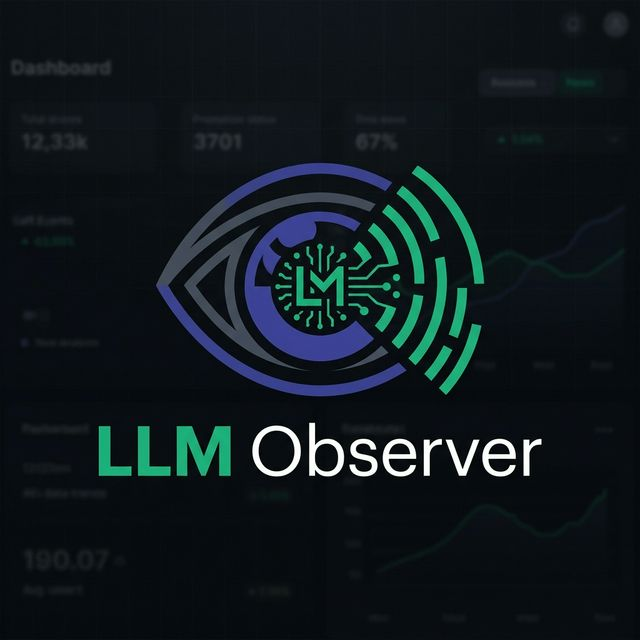

<p align="center">
  
  <br />
  <strong>LLM Observer</strong>
  <br />
  <em>Your AI spend. Your control.</em>
</p>

<p align="center">
  <a href="https://github.com/Ranjitbehera0034/llm-observer/blob/main/LICENSE"></a>
  <a href="https://www.npmjs.com/package/llm-observer"></a>
  <a href="https://github.com/Ranjitbehera0034/llm-observer/commits"></a>
  <a href="https://github.com/Ranjitbehera0034/llm-observer/stargazers"></a>
</p>

<p align="center">
  See every dollar across 8 AI coding tools: Claude Code, Cursor, Aider, GitHub Copilot, Windsurf, Cline, OpenAI Codex CLI, and OpenCode — without changing how you work.
</p>

<p align="center">
  <a href="#quickstart">Quickstart</a> · <a href="#features">Features</a> · <a href="#how-it-works">How It Works</a> · <a href="#dashboard-pages">Dashboard</a> · <a href="#configuration">Configuration</a> · <a href="#verify-your-own-numbers">Verify Your Own Numbers</a> · <a href="#roadmap">Roadmap</a> · <a href="#contributing">Contributing</a>
</p>

---

## Quickstart

**Prerequisites:** Node.js 18+ (`node --version` to check)

### Option 1 — npm (recommended)

```bash
npm install -g llm-observer
llm-observer start
```

### Option 2 — Desktop app

Download the signed installer for your OS from [Releases](https://github.com/Ranjitbehera0034/llm-observer/releases/latest) — no Node.js required. See [packages/desktop](packages/desktop) for how release binaries are signed.

### Option 3 — Run from source

```bash
git clone https://github.com/Ranjitbehera0034/llm-observer.git
cd llm-observer
npm install
npm run build
npm start
```

Dashboard opens at **http://localhost:4001**. That's it.

On first launch, LLM Observer automatically detects your installed AI tools, parses your session history, and shows a populated dashboard — **no API keys, no proxy setup, no account required.**

> **Want billing-accurate costs?** Add your provider Admin API keys in the dashboard (Sync page). See [Add Provider Keys](#add-provider-keys) below.

---

## Features

### Session Tracking (Zero Config)

- **Auto-Detection** — Automatically finds Claude Code, Cursor, Aider, GitHub Copilot, Windsurf, Cline, OpenAI Codex CLI, and OpenCode data on your machine
- **Session Explorer** — Browse every AI conversation with cost, duration, tokens, model, and project
- **Incremental Parsing** — Only new/modified files are re-parsed on startup (fast after first run)
- **Session Type Labels** — Automatically classifies sessions as "interactive" or "agentic"
- **Recorded-format regression tests** — Every parser is checked against checked-in fixtures of real log formats (current and legacy) in CI, so an upstream format change is caught before it silently shows a user $0 — see [Guarding against upstream format drift](#guarding-against-upstream-format-drift)

### Subagent Observability

- **Agent Tree View** — See every subagent Claude Code spawns — cost, tools used, duration per agent
- **Agent Classification** — Auto-labels agents as Explore, Plan, Execute, Validate, or General
- **Agent KPIs** — Total agents spawned, cost breakdown by type, most expensive agents

### Tool Usage Analytics

- **Cost by Operation** — See which operations (Read, Write, Bash, Search) consume the most tokens
- **Tool Frequency** — Which tools your AI calls most and their cost attribution
- **Redundant Detection** — Flags waste like reading the same file 100+ times across sessions

### Optimization Engine & ROI

- **Health Score** — A single score for how efficiently a project is spending, with a real plan-value multiple (identified savings ÷ what LLM Observer itself costs)
- **Git Correlation** — Link AI sessions directly to git commits to measure true return on investment
- **Spend Forecasting** — Predictive models forecast your API spend for the rest of the billing cycle
- **Migration Calculator** — Instantly compare costs for migrating workflows to cheaper models

### AI Analyst *(opt-in, bring your own key)*

- Sends only **aggregated metadata** — token totals, costs, tool-call counts, cache-hit rates, never prompts, responses, file paths, or project names — to Claude for a plain-English spend summary and prioritized recommendations
- Requires your own Anthropic API key, entered locally; nothing runs unless you provide one

### Response Drift Detection

- Flags when a project's responses start drifting from its own historical baseline, using lexical/statistical scoring (term-frequency cosine similarity against an EMA-bounded centroid, 3-sigma outlier detection) — not a ground-truth hallucination detector, but a real, opt-in early-warning signal that something about a model or prompt changed

### A/B Comparison

- Statistically honest comparison of two historical segments (e.g. model A vs model B, or before/after a prompt change) using a two-sample z-test for cost/latency and a two-proportion z-test for error rates — compares data you already have, not live traffic splitting

### Reasoning-Chain Debugger

- Reconstructs the step-by-step reasoning/tool-call chain for any request (Anthropic and OpenAI-shaped payloads) directly in the Request Detail view, with a raw-JSON fallback

### PII Redaction *(opt-in, off by default)*

- Regex + Luhn-validated detectors for email, phone, SSN, credit card, AWS keys, and generic API keys/tokens, applied to proxied traffic before it's stored — off unless you turn it on in Settings

### Provider API Sync

- **Billing-Accurate Costs** — Pull real spend from Anthropic and OpenAI admin APIs (matches your invoice)
- **Automatic Polling** — Syncs every 60 seconds in the background
- **Multi-Provider** — Single dashboard for Anthropic + OpenAI with aggregated totals

### Budget Control

- **Per-Provider / Per-Model Budgets** — Set daily, weekly, or monthly limits
- **Three-Threshold Alerts** — Notifications at 80%, 90%, and 100% of budget
- **Kill Switch** — Optionally hard-block proxy requests when a budget is exceeded
- **Pre-Estimation** — Estimates request cost *before* sending to prevent overshoot
- **Desktop Notifications** — Native OS alerts, not just in-dashboard (macOS, Linux, Windows)

### AI Wrapped

- **Monthly & Yearly Reports** — Complete spending analysis with trends and comparisons
- **Shareable Cards** — Download visual cards (1200×630px) optimized for Twitter/LinkedIn
- **Four Insight Algorithms** — Model optimization, cache efficiency, subscription value, budget compliance
- **Privacy Toggles** — Control which stats appear on the card before sharing

### Network Monitor

- **Per-App Attribution** — See which app (Cursor, Claude Code, scripts) drives your cost
- **Zero Setup for Apps** — Uses OS-level connection detection (`lsof` / `ss`), no per-app config
- **Subscription Insight** — Estimates API-equivalent cost for subscription tools like Cursor Pro

### Unified Dashboard

- **Complete Budget View** — API spend (tracked) + subscriptions (manual) in one total
- **Deduplication** — Sync data wins over proxy data; never double-counts
- **Subscription Presets** — One-click add for Cursor Pro, Copilot, ChatGPT Plus, Claude Pro, and more

### Local Proxy (Optional)

- **Per-Request Detail** — Full prompt, response, and latency for proxied traffic
- **Budget Enforcement** — Kill switch blocks requests when limits are hit
- **Provider Error Forwarding** — 402/429 errors passed through with `_source` field
- **Ollama, first-class** — Local models route through the same proxy and are always tracked at $0 cost, no API key needed

---

## How It Works

LLM Observer has four independent data engines. Use any combination:

```
Engine 1: Session Parser                Engine 2: Usage API Sync
Reads local files from                  Polls Anthropic & OpenAI admin APIs
~/.claude/, ~/.cursor/, ~/.aider/       for billing-accurate spend data
Setup: None (auto-detects)              Setup: Add admin API key (30 sec)
Gives: Per-session detail               Gives: Exact cost matching invoice

Engine 3: Network Monitor               Engine 4: Local Proxy
Detects which apps connect              Intercepts requests for full
to AI API endpoints                     prompt/response capture
Setup: Enable in Settings               Setup: Route traffic through proxy
Gives: Per-app attribution              Gives: Per-request detail + kill switch
```

**All data stays local.** SQLite database on your machine. No cloud. No telemetry. No account.

**Data priority:** When multiple engines report cost for the same provider, Usage API sync (billing-accurate) takes precedence. Session parser provides per-session breakdown. They complement each other.

---

## Add Provider Keys

Session parsing estimates costs from token counts (~95% accurate). For exact billing data:

### Anthropic

1. Go to [console.anthropic.com](https://console.anthropic.com) → Settings → Admin API Keys
2. Create a key (starts with `sk-ant-admin-`)
3. Dashboard → Sync page → Anthropic card → paste key

### OpenAI

1. Go to [platform.openai.com/settings/organization/admin-keys](https://platform.openai.com/settings/organization/admin-keys)
2. Create a key (requires Organization Owner role, starts with `sk-admin-`)
3. Dashboard → Sync page → OpenAI card → paste key

### Ollama (local models)

No key needed. Set the base URL in Dashboard → Settings (defaults to `http://localhost:11434`) and route traffic through the proxy — usage is tracked, cost is always $0.

Keys are encrypted with AES-256-GCM locally. Never logged, never sent anywhere.

---

## Dashboard Pages

| Page | What It Shows |
|------|---------------|
| **Control Room** (Overview) | Total spend, daily trends, provider breakdown, budget status, most expensive sessions |
| **Apps** | Per-application cost attribution (requires network monitor) |
| **API Sync** | Provider API key management and sync status |
| **Sessions** | Every AI session — sortable by cost, filterable by provider/model/project/type |
| **Agents** | Subagent tree views, agent type breakdown, per-agent cost KPIs |
| **Optimize** | Health score, optimization rules, ROI/plan-value, AI Analyst recommendations |
| **Compare** | Statistical A/B comparison between models, projects, or time windows |
| **Limits** | Rate-limit tracking and activity heatmap |
| **Tools** | Cost by operation, tool frequency chart, redundant pattern detection |
| **Requests** | Per-request detail for proxied traffic, including the reasoning-chain debugger |
| **Insights** | Cost optimizer suggestions, duplicate prompt detection, model downgrade opportunities |
| **Projects** | Multi-project cost isolation — separate budgets per app or environment |
| **AI Wrapped** | Monthly/yearly reports with insights and shareable cards |
| **Alerts** | Webhook alert rules for budget thresholds and anomaly spikes |
| **Settings** | Session sources, per-app tracking toggle, budget management, PII redaction, drift detection, license activation |

---

## Configuration

### Environment Variables

| Variable | Default | Description |
|----------|---------|-------------|
| `LLM_OBSERVER_PORT` | `4001` | Dashboard and API port |
| `LLM_OBSERVER_HOST` | `127.0.0.1` | Bind address |
| `LLM_OBSERVER_DATA_DIR` | `~/.llm-observer` | Database and config location |
| `LLM_OBSERVER_PROXY_PORT` | `4000` | Proxy port (when enabled) |
| `NO_UPDATE_NOTIFIER` | unset | Set to any value to disable the CLI's background npm-version check |

### CLI

```bash
llm-observer start                   # Boot the proxy server and dashboard UI
llm-observer status                  # Check if the proxy and dashboard are online
llm-observer stats                   # Terminal stats display (--model / --provider filters)
llm-observer budget set 50 --daily   # Manage budgets
llm-observer export --format csv     # Export metrics data
llm-observer logs --tail             # Stream recent proxy request logs
llm-observer projects                # List projects and budget statuses
llm-observer pricing update          # Refresh pricing from the remote registry
llm-observer config                  # View/edit local settings
llm-observer reset                   # Wipe the local database (asks for confirmation)
llm-observer stop                    # Graceful shutdown

# Custom ports / data location via environment variables:
LLM_OBSERVER_PORT=3000 llm-observer start
```

> **License activation and upgrading to Pro currently happen in the Dashboard** (Settings → License & Billing), not the CLI — `llm-observer activate`/`billing`/`upgrade`/`team` exist as commands but are placeholders pending a follow-up to wire them to the same backend the dashboard already uses.

### Auto-Detected Session Files

| Tool | Location | Format |
|------|----------|--------|
| Claude Code | `~/.claude/projects/` | JSONL |
| Cursor IDE | `~/.cursor/ai-tracking/ai-code-tracking.db` | SQLite |
| Aider | `~/.aider/analytics.jsonl` | JSONL |
| GitHub Copilot | `~/Library/.../github.copilot-chat/state.vscdb` | SQLite |
| Windsurf | `~/Library/.../Windsurf/User/globalStorage/*/state.vscdb` | SQLite |
| Cline / Roo Code | `~/Library/.../globalStorage/{extensionId}/tasks/*/api_conversation_history.json` | JSON |
| OpenAI Codex CLI | `~/.codex/sessions/*.jsonl` | JSONL |
| OpenCode | `~/.local/share/opencode/opencode.db` | SQLite |

All files are read in **read-only mode**. LLM Observer never modifies any AI tool's data.

---

## What LLM Observer Does NOT Do

- **Does not store your prompts or responses** — Database contains token counts, costs, and metadata only, for data parsed passively from editor session logs. (The optional local proxy is the one path that does store `request_body`/`response_body` — it's an explicit opt-in, off by default, and exists specifically to give you per-request detail when you choose to route traffic through it.)
- **Does not redact anything by default** — PII redaction exists but is opt-in; off until you turn it on in Settings
- **Does not intercept traffic by default** — Proxy is optional and off by default
- **Does not send data anywhere** — No telemetry, no cloud, no analytics. The one opt-in exception is the AI Analyst, which sends only aggregated metadata (never prompts/responses) to Claude, and only if you supply your own API key. Separately, the CLI does a background check against the public npm registry for newer versions (no data sent beyond the package name, same as running `npm outdated`) — disable with `NO_UPDATE_NOTIFIER=1` or `--no-update-notifier`.
- **Does not require root privileges** — Runs as your user account
- **Does not modify AI tool behavior** — Unless you explicitly enable proxy with kill switch
- **Does not claim compliance certifications it doesn't have** — no SOC 2, no HIPAA. Everything here is "your data never leaves your machine unless you tell it to," which is a real, verifiable property — not a substitute for a real audited compliance program

---

## Verify Your Own Numbers

Don't take the dashboard's token counts and costs on faith. `scripts/verify-costs.js` independently recomputes both directly from the raw `~/.claude/projects/**/*.jsonl` files — using its own copy of the dedup rule and pricing formula, not by calling into the app's own code — and diffs the result against what's actually stored in the local database.

```bash
node scripts/verify-costs.js                    # uses default paths
node scripts/verify-costs.js --data-dir ~/.llm-observer --claude-dir ~/.claude/projects
node scripts/verify-costs.js --json              # machine-readable output
```

Exits `0` if every session matches exactly, `1` otherwise. A session actively being written to (e.g. one that's still open) will legitimately show a mismatch until the app re-scans it — that's expected, not a bug.

### Guarding against upstream format drift

Editors change their session-log format without warning, which is how token counts silently go to $0. `packages/proxy/src/parsers/__tests__/formatMatrix.test.ts` guards against this: it re-parses a set of recorded, real-shaped fixture files (`__tests__/fixtures/claude/`) and asserts the output against a checked-in golden manifest (`__tests__/fixtures/format-matrix.json`), covering both the current nested Claude Code format and the older top-level-fields format it still needs to read. This runs as its own `parser-format-drift` job in CI (`.github/workflows/ci.yml`), separate from the main test job, so a format regression shows up as a distinctly labeled, easy-to-spot failed check. Currently covers the Claude Code parser; the same manifest pattern is meant to be extended to the other editor parsers as their fixture suites land.

---

## Tech Stack

- **Runtime**: Node.js 20+ / 22 + Express
- **Database**: SQLite (`better-sqlite3`) for the local app; MongoDB/Mongoose for the optional team-server
- **Frontend**: React 18 + Vite + Tailwind CSS
- **Desktop**: Tauri 2 (see [packages/desktop](packages/desktop) and [SIGNING.md](packages/desktop/SIGNING.md))
- **Language**: TypeScript (full stack)
- **Monorepo**: npm workspaces

```
llm-observer/
├── packages/
│   ├── cli/             # CLI entry point, published to npm as `llm-observer`
│   ├── proxy/            # API server, session-log parsers, optimization/analysis engines
│   ├── database/         # Schema, migrations, repositories (SQLite)
│   ├── dashboard/         # React frontend
│   ├── desktop/           # Tauri desktop app (wraps the proxy + dashboard)
│   ├── license-server/    # Vercel-hosted payment webhook relay + license key issuance
│   └── team-server/       # Express + MongoDB team auth backend (API-only — see Roadmap)
├── landing-page/          # Marketing site source (llm-observer.com)
└── scripts/verify-costs.js
```

---

## Development

```bash
git clone https://github.com/Ranjitbehera0034/llm-observer.git
cd llm-observer
npm install
npm run build
npm run dev          # Dev mode with hot reload
npm test             # Run all tests
```

---

## Comparison

| Capability | LLM Observer | BurnRate | Helicone | Langfuse |
|:-----------|:---:|:---:|:---:|:---:|
| Zero-config session parsing | ✅ | ✅ | ❌ | ❌ |
| Billing-accurate costs (API sync) | ✅ | ❌ | ❌ | ❌ |
| Budget enforcement (kill switch) | ✅ | ❌ | ❌ | ❌ |
| Network-level app detection | ✅ | ❌ | ❌ | ❌ |
| Subagent observability | ✅ | ✅ | ❌ | ❌ |
| Tool usage analytics | ✅ | ✅ | ❌ | ❌ |
| Statistical A/B comparison | ✅ | ❌ | Partial | ✅ |
| Response drift detection | ✅ | ❌ | ❌ | Partial |
| PII redaction (opt-in) | ✅ | ❌ | Partial | Partial |
| Fully open source | ✅ | ❌ | Partial | ✅ |
| 100% local (no cloud) | ✅ | ✅ | ❌ | Self-host |
| No code changes required | ✅ | ✅ | ❌ | ❌ |
| Shareable spending reports | ✅ | Basic | ❌ | ❌ |

---

## Roadmap

### Shipped

| Version | Feature |
|---------|---------|
| v1.1.0 | Anthropic Usage API sync |
| v1.2.0 | OpenAI Usage API sync |
| v1.3.0 | Unified dashboard + subscription tracking |
| v1.4.0 | Per-provider budgets + alerts + notifications |
| v1.5.0 | Network monitor (per-app attribution) |
| v1.7.0 | Budget Guard v2 (pre-estimation) |
| v1.8.0 | AI Wrapped (monthly/yearly reports) |
| v1.9.0 | Session file parser + session explorer |
| v1.10.0 | Subagent observability + tool analytics |
| v1.11.0 | ROI analysis (git correlation) + spend forecasting |
| v1.12.0 | Optimization engine (20+ rules) |
| v1.13.0 | Rate limit tracking + activity heatmap |
| v1.14.0 | 7-tool parser parity (Copilot, Windsurf, Cline, Codex) |

### v2.0.0 (this repo, pending release)

| Feature | Notes |
|---------|-------|
| Desktop app (Tauri) | Builds today; auto-update signing requires the maintainer to generate and store a real keypair — see [SIGNING.md](packages/desktop/SIGNING.md) |
| Ollama as a first-class provider | Local models tracked at $0 cost through the same proxy |
| AI Analyst | Opt-in, BYOK, aggregated-metadata-only spend analysis via Claude |
| ROI / plan-value | Health score now shows a real "×your plan cost" multiple |
| PII redaction | Opt-in, off by default |
| Response drift detection | Lexical/statistical, not ground-truth hallucination detection |
| A/B comparison | Statistical comparison of historical segments, not live traffic splitting |
| Reasoning-chain debugger | Step-by-step tool-call reconstruction in Request Detail |
| Team auth backend (Phase 1 of SSO) | Password + OIDC login, team membership, on `team-server` — **API-only**, no dashboard UI or CLI wiring yet |
| Independent cost verification script + CI format-drift guard | `scripts/verify-costs.js`, `parser-format-drift` CI job |
| npm release checksums | `CHECKSUMS.txt` attached to every published release |

### Coming Next

| Feature | Notes |
|---------|-------|
| SAML (Phase 2 of SSO) | For IdPs that require it specifically, once OIDC (Phase 1) has real usage |
| Team dashboard UI (Phase 3 of SSO) | A "Team" tab in Settings talking to `team-server` |
| Wire CLI `activate`/`billing`/`team` to the real backend | Currently placeholders; the dashboard already does this correctly |
| Format-drift fixture matrix for Cursor, Aider, Cline, Codex | Extending the pattern already live for Claude Code |
| Homebrew formula | For the desktop app |
| More editor parsers | JetBrains AI, Continue, Gemini Code Assist |
| Enterprise: audit logging, cost allocation | Depends on the team-auth foundation above |
| Agent platform | Per-customer attribution, guardrails |

---

## FAQ

<details>
<summary><strong>Does it slow down my AI tools?</strong></summary>
<br />
No. The session parser reads files that already exist — it doesn't intercept traffic. The API sync polls every 60 seconds in the background. Neither adds latency.
</details>

<details>
<summary><strong>Do I need to change how I use my tools?</strong></summary>
<br />
No. LLM Observer reads data your tools already produce. No SDK, no config changes, no base URL changes (unless using the optional proxy).
</details>

<details>
<summary><strong>How accurate are cost estimates?</strong></summary>
<br />
Session-estimated costs are within ~5% of actual billing. For exact numbers, add your Admin API key — the Usage API sync matches your invoice. You don't have to take that on faith either — see <a href="#verify-your-own-numbers">Verify Your Own Numbers</a>.
</details>

<details>
<summary><strong>Is my data safe?</strong></summary>
<br />
Everything stays in a local SQLite database. No cloud, no telemetry, no account. Admin keys are AES-256-GCM encrypted. The database stores costs and metadata — never prompts or responses, except for the optional local proxy (off by default) which you'd explicitly route traffic through.
</details>

<details>
<summary><strong>Can I use this at work?</strong></summary>
<br />
Yes. Everything runs locally with no data leaving your machine. A team-auth backend exists (password + OIDC login, team membership) but doesn't have a dashboard UI yet — see the Roadmap.
</details>

<details>
<summary><strong>What if Claude Code changes its file format?</strong></summary>
<br />
The parser handles known format variations (current and legacy) and is checked against recorded fixtures in CI (<a href="#guarding-against-upstream-format-drift">Guarding against upstream format drift</a>) — a regression there fails a distinctly-labeled CI check before it ships. Malformed or entirely novel formats are skipped per-line rather than crashing the whole session.
</details>

---

## Contributing

Contributions welcome. See [CONTRIBUTING.md](CONTRIBUTING.md) for guidelines.

**Help needed with:**
- Format-drift fixture tests for Cursor, Aider, Cline, and Codex parsers
- Session file parsers for new tools (JetBrains AI, Continue, Gemini Code Assist)
- Optimization rules
- Dashboard UI improvements
- Test coverage

---

## License

[MIT](LICENSE)

---

<p align="center">
  Every feature answers at least one of:<br />
  <strong>How much am I spending?</strong> · <strong>Can I stop overspending?</strong> · <strong>Where can I spend less?</strong> · <strong>Is it worth it?</strong>
</p>
